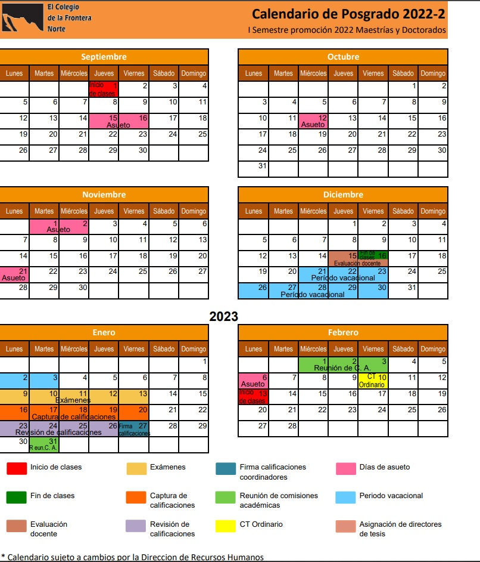

El curso comprende **16 sesiones** que se llevarán a cabo en las siguientes fechas y horarios: 

## Septiembre

> ### Sesión 1  
> #### Miércoles   7 
>  - **Hora:   10  am - 1 pm**

#### Objetivos: 
Presentación del profesor, entrega y explicación del programa del curso: objetivos de aprendizaje,  bibliografía, actividades a evaluar y método de evaluación.  

Evaluación en tres dimensiones: Ejercicios en clase, ejercicios asigandos de práctica (tarea), 

**Actividades en clase:**

Instalación de R y R  Studio.  Anaconda, Python. Dar tutorial del entorno de trabajo de Jupyter Notebook.  

****

> ### Sesión 2  
> #### Viernes 9         
>  - **Hora: 3-5 pm**

#### Objetivos de aprendizaje:
****

> ### Sesión 3  
> #### Lunes  12         
>  - **Hora: 3-5 pm**

#### Objetivos de aprendizaje:
****

> ### Sesión 4  y 5 
> #### Miercoles 14
>  - **Hora: 10- 1pm  y 3 -5 pm**

#### Objetivos de aprendizaje:
****

> ### Sesión 6 
> #### Miercoles 21
>  - **Hora: 10- 1pm**

#### Objetivos de aprendizaje:
****

> ### Sesión 7 
> #### Miercoles 28
>  - **Hora: 10- 1pm**

#### Objetivos de aprendizaje:
****
## Octubre 

> ### Sesión 8 
> #### Miércoles 5
>  - **Hora: 10- 1pm**

#### Objetivos de aprendizaje:
****

> ### Sesión 9 
> #### Miércoles 19
>  - **Hora: 10- 1pm**

#### Objetivos de aprendizaje:
****

> ### Sesión 10 
> #### Miércoles 26
>  - **Hora: 10- 1pm**

#### Objetivos de aprendizaje:
****

## Noviembre 

> ### Sesión 11
> #### Miércoles 9
>  - **Hora: 10- 1pm**

#### Objetivos de aprendizaje:
****

> ### Sesión 12 
> #### Miércoles 16
>  - **Hora: 10- 1pm**

#### Objetivos de aprendizaje:
****

> ### Sesión 13 
> #### Miércoles 23
>  - **Hora: 10- 1pm**

#### Objetivos de aprendizaje:
****

> ### Sesión 14
> #### Miércoles 30
>  - **Hora: 10- 1pm**

#### Objetivos de aprendizaje:
****

## Diciembre

> ### Sesión 15 
> #### Miércoles 7
>  - **Hora: 10- 1pm**

#### Objetivos de aprendizaje:
****
> ### Sesión 16 
> #### Miércoles 14
>  - **Hora: 10- 1pm**

#### Objetivos de aprendizaje:
****

